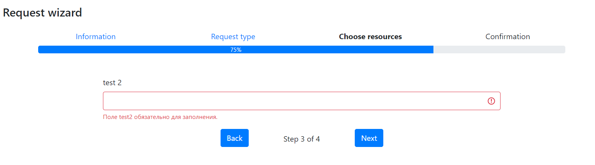

# Laravel-wizard



simple laravel step-by-step wizard

| Version | Laravel Version | Php Version | 
|---- |----|----|
| 1.1 | 5.* | ^7.0 |
| ^2.0 | 6.* &#124;&#124; 7.* &#124;&#124; 8.* | ^7.2 |

## Install

    $ composer require james.rus52/laravel-wizard

## Example/How

1. add routes
    
    ```php
   
    Route::get('/create/{step?}', [\App\Http\Controllers\CreationRequestsController::class, 'create'])
            ->name('requests.create');
        Route::post('/create/{step}', [\App\Http\Controllers\CreationRequestsController::class, 'store'])
            ->name('requests.store');
    ```

2. create steps

    create step class
    
    ```php
   
   class InformationStepWizard extends \jamesRUS52\Laravel\Step
   {
      public function process(Request $request)
      {
         $this->saveProgress($request);
      }

       public function getAuxData(): array
       {
           return [
               'owners' => 'Some extra data for view on this step',
           ];
       }

       public function rules(Request $request = null): array
       {
           return [
               'owner' => 'required',
           ];
       }
   }

    ```
    
3. create controller

    ```php
    class CreationRequestsController extends Controller
   {
   protected Wizard $wizard;
   
       public function __construct()
       {
           $this->wizard = new Wizard('Request wizard', [
               new InformationStepWizard('information', 'Information', 'requests.create.information-step-wizard'),
               new RequestTypeStepWizard('request-type', 'Request type', 'requests.create.request-type-step-wizard'),
               new ResourcesStepWizard('resources', 'Choose resources', 'requests.create.resources-step-wizard'),
               new ConfirmationStepWizard('confirmation', 'Confirmation', 'requests.create.confirmation-step-wizard'),
           ],
               'creation-request'
           );
       }
   
       public function create($step_slug = null)
       {
           try {
               if (is_null($step_slug)) {
                   $step = $this->wizard->firstOrLastProcessed();
               } else {
                   $step = $this->wizard->getBySlug($step_slug);
               }
           } catch (StepNotFoundException $e) {
               abort(404);
           }
   
           return view('requests.create.layout-wizard',
               array_merge([
                       'type' => 'creation',
                   ],
                   $step->getAuxData(),
               )
           );
       }
   
       public function store(Request $request, $step_slug = null)
       {
           try {
               $step = $this->wizard->getBySlug($step_slug);
           } catch (StepNotFoundException $e) {
               abort(404);
           }
   
           $this->validate($request, $step->rules($request));
           $step->process($request);
   
           if ($this->wizard->hasNext()) {
               return redirect()->route('requests.create.', [$this->wizard->nextStep(false)->slug]);
           }
   
           // Finaly Create Request
           $full_wizard_data = $this->wizard->data();
           $this->wizard->clearProgress();
   
           return redirect()->route('requests.index');
       }
   }
    ```

4. add base view
$wizard variable is now automatic sheared with view
   Layout wizard template
   
    ```php
    <h4>{{$wizard->getTitle()}}</h4>
    <div class="container container-fluid mt-4 mb-5">
        <div class="row">
        @foreach($wizard->getSteps() as $step)
            <div class="col text-center">
                @if($step->index == $wizard->currentStep()->index)
                    <strong>{{ $step->label }}</strong>
                @elseif($wizard->currentStep()->index > $loop->index)
                    <a class="text-primary" href="{{ route('requests.create.'.$type, [$step->slug]) }}">{{ $step->label }}</a>
                @else
                    {{ $step->label }}
                @endif
            </div>
        @endforeach
        </div>
        <div class="progress m-2">
            <div class="progress-bar" role="progressbar" style="width: {{$wizard->completionPercent()}}%;" aria-valuenow="{{$wizard->completionPercent()}}" aria-valuemin="0" aria-valuemax="100">{{$wizard->completionPercent()}}%</div>
        </div>
    </div>


    <form action="{{ route('requests.store.'.$type, [$wizard->currentStep()->slug]) }}" method="POST" novalidate>
        @csrf

        <div class="container mt-5">
            <div class="row justify-content-center">
                <div class="col-12 col-lg-9">
                    @include($wizard->currentStep()->view, ['step' => $wizard->currentStep(), 'errors' => $errors])
                </div>
            </div>
            <div class="row justify-content-center">
                @if ($wizard->hasPrev())
                <div class="col-2 text-right">
                    <a class="btn btn-primary" href="{{ route('requests.create.'.$type, ['step' => $wizard->prevStep(false)->slug]) }}">Back</a>
                </div>
                @endif

                <div class="col-2 text-center pt-2">
                    Step {{ $wizard->currentStep()->getNumber() }} of {{ $wizard->stepsCount() }}
                </div>

                <div class="col-2 text-left">
                    @if ($wizard->hasNext())
                        <button class="btn btn-primary" type="submit">Next</button>
                    @else
                        <button class="btn btn-primary" type="submit">Finish</button>
                    @endif
                </div>
            </div>
        </div>
    </form>
    ```
   
## License

Laravel wizard is open-sourced software licensed under the [MIT license](https://opensource.org/licenses/MIT)
